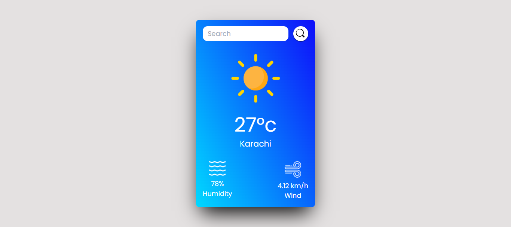

# 🌤️ Weather App

A simple weather app built using React.js that allows users to search for current weather conditions in any city. The app fetches real-time data from the OpenWeatherMap API and displays essential information like temperature, humidity, and wind speed.



## 🚀 Features

🌍 Real-time Weather Data: Get up-to-date weather information for any city.
🔍 Search Functionality: Easily search for different locations.
🌡️ Temperature: Displays temperature in Celsius.
💨 Wind Speed: Shows current wind speed in km/h.
💧 Humidity: Displays the humidity percentage.
🌦️ Dynamic Icons: Weather icons change based on current weather conditions (clear, cloudy, rainy, etc.).

## 🛠️ Tech Stack

⚛️ React.js: JavaScript library for building user interfaces.
🌐 OpenWeatherMap API: Used for fetching weather data.
🎨 Tailwind CSS: Used for styling the app.
🖼️ React Icons: For icons used in the app.

## 📦 Installation

1. Clone the repository:

   ```bash
   git clone https://github.com/yourusername/weather-app.git
   ```

2. Navigate to the project directory:
   ```bash
   cd weather-app
   ```
3. Install dependencies:
   ```bash
   npm install
   ```
4. Create a `.env` file in the root of the project and add your OpenWeatherMap API key:
   ```env
   VITE_API_ID=your_api_key_here
   ```
5. Run the app:
   ```bash
   npm run dev
   ```

## 🌐 API

This project uses the [OpenWeatherMap API](https://openweathermap.org/api) to fetch weather data.

## 🔗 Links

Live Demo: [Weather App](https://your-live-demo-link.com)
GitHub Repository: [Weather App Repo](https://github.com/yourusername/weather-app)

---

💡 Feel free to fork this project and improve it! Contributions are always welcome.

```

You can use this version in your VS Code and adjust the links as needed.
```

```

```
